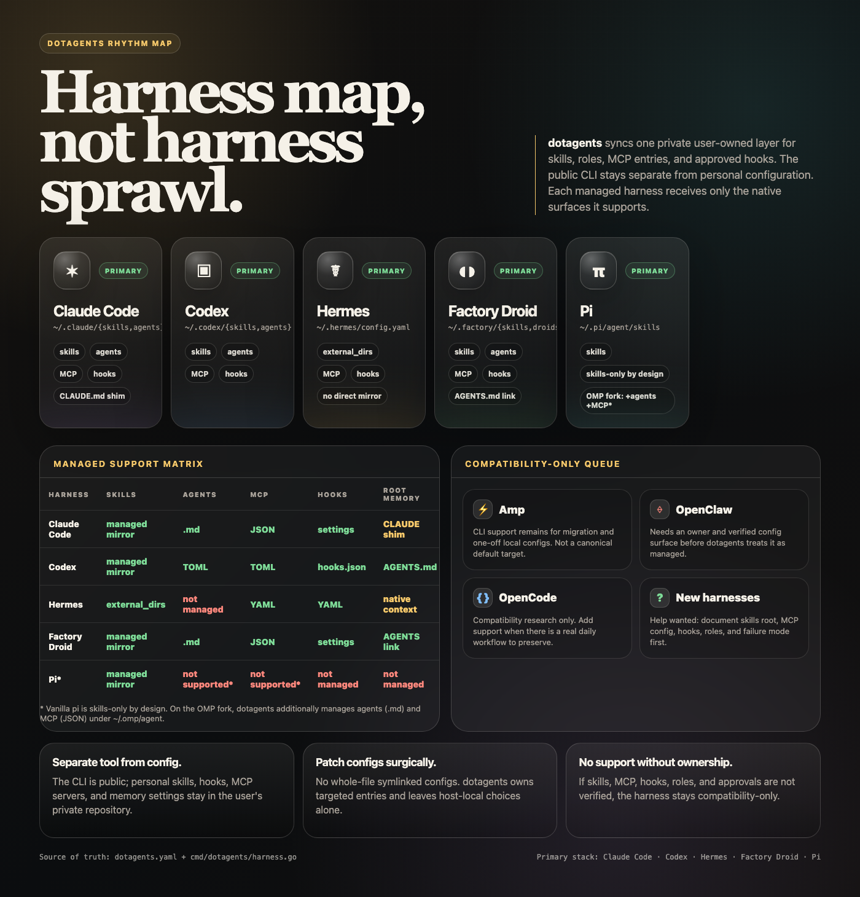

# dotagents

Cross-agent sync CLI for managing shared skills, agent roles, and MCP servers across the primary coding-agent stack: Claude Code, Codex, Factory Droid, Hermes, and Pi/OMP. Amp, OpenClaw, OpenCode, and similar non-primary harnesses are compatibility-only unless explicitly configured.

This repo is the canonical `~/.agents` layer. It detects installed agent platforms, syncs shared skills and MCP entries to each platform's native format, validates drift, and self-tests.



[Open the full harness map.](./docs/harness-map.html)

## Agent instructions

[`AGENTS.md`](./AGENTS.md) is the canonical instruction file. [`CLAUDE.md`](./CLAUDE.md) is only a compatibility shim for agents that look for Claude-style project memory.

## Install

Two ways to consume this repo - pick exactly one per machine and harness:

| You want | Do this |
|---|---|
| Just the skills in Claude Code | `/plugin marketplace add yourconscience/dotagents` then `/plugin install dotagents@yourconscience` |
| Just the skills in Codex | `codex plugin marketplace add https://github.com/yourconscience/dotagents` then `codex plugin add dotagents@yourconscience` |
| The full managed setup (skills, roles, MCP, hooks) on any supported harness - Claude Code, Codex, Hermes, Factory Droid, Pi/OMP | Install the `dotagents` CLI (below), clone the repo, run `dotagents setup` |

Plugins snapshot the repo at install time and update through each harness's plugin update flow. `dotagents sync` keeps live symlinks instead. Do not combine both on the same harness or skills appear twice; see "Installing this repo as a plugin" for details and how `delivery:` arbitrates this for Claude Code.

### CLI install

Prebuilt binaries for macOS and Linux (amd64/arm64) are attached to [GitHub Releases](https://github.com/yourconscience/dotagents/releases). With Go installed:

```bash
go install github.com/yourconscience/dotagents/cmd/dotagents@latest
```

Or from a clone:

```bash
go install ./cmd/dotagents
```

Ensure the Go install directory is on `PATH`. If `go env GOBIN` is non-empty, add that directory; otherwise add `$(go env GOPATH)/bin`.

After that, run first-time machine setup (creates `~/.agents`, patches detected agent configs, syncs), or inspect state directly:

```bash
dotagents setup
dotagents status
dotagents deps check
```

Releases are cut by pushing a `v*` tag; CI runs GoReleaser, which builds the archives and publishes the GitHub Release.

## Alternatives

How dotagents compares to other cross-agent config sync tools:

| | dotagents | [skillshare](https://github.com/runkids/skillshare) | [vsync](https://github.com/nicepkg/vsync) | [agents-cli](https://github.com/amtiYo/agents) |
|---|---|---|---|---|
| Skills sync | yes (symlinks + config-driven dirs) | yes | yes | yes |
| MCP sync | yes | no | yes | yes |
| Hooks sync | yes (Claude Code, Codex, Hermes, Droid) | no | no | no |
| Native subagent roles | yes (Claude Code, Codex, Droid) | agents as files | yes | no |
| Plugin catalog | yes (first-party `dotagents.yaml` entries) | no | no | no |
| External skill pinning | yes (`dotagents.lock`) | version tracking | no | no |
| Skill security audit | yes (`dotagents doctor`) | yes | no | no |
| Local private overlay | yes (`dotagents.local.yaml`) | no | no | no |
| Target agents | Claude Code, Codex, Amp, Hermes, Factory Droid, Pi/OpenClaw | Claude Code, Codex, Cursor, Gemini, 60+ | Claude Code, Cursor, OpenCode, Codex | Codex, Claude Code, Gemini CLI, Cursor, Copilot, others |
| Language | Go | Go | TypeScript | TypeScript |

dotagents focuses on the post-IDE agent stack (Hermes, Amp, Droid, OpenClaw/Pi alongside Claude Code and Codex) and on syncing the full surface - skills, MCP, hooks, roles, plugins, root instructions - from one canonical `~/.agents` layer.

## Agents

Reusable agent role definitions for agent-native subagents. Canonical roles live in `agents/*.yaml`; `dotagents sync` renders them to each configured native format:

- Claude Code: `~/.claude/agents/<name>.md`
- Codex: `~/.codex/agents/<name>.toml`
- Factory Droid: `~/.factory/droids/<name>.md`

- `architect` - designs system architecture, telemetry schemas, and technical plans. Sonnet, read + write.
- `builder` - implements code changes following specs or architect designs. Sonnet, read + write.
- `researcher` - investigates codebases, APIs, repos, and web sources. Sonnet, read + write + web.
- `reviewer` - reviews code against specs, finds bugs and security issues. Sonnet, read-only.

Reference these from TeamCreate teammates, Claude Code subagent types, or Codex native subagent roles. See `skills/spawn/SKILL.md` for usage patterns.

## Skills

- `cmux` - control cmux workspaces, panes, terminal/browser surfaces, markdown viewers, and visible agent workspaces.
- `tmux` - generic tmux reference for sessions, windows, panes, screen capture, and input.
- `dotagents` - inspect and sync the repo-owned skill links across supported coding agents.
- `grill-me` - pressure-test a plan one question at a time until scope and decisions are concrete.
- `gws` - Google Workspace workflows. On Hermes, prefer the bundled native `google-workspace` skill; this repo's `skills/gws` remains the shared source for Claude Code/Codex and CLI helpers.
- `humanizer` - final-pass rewriting for concise writing that keeps the user's voice.
- `jobs` - track job search pipeline, analyze fit for postings, generate interview quizzes, grade answers.
- `remote-access` - search local Droid/Codex sessions and send scoped continuation instructions through the Mac bridge from mobile.
- `pr-triage` - inspect PR failures and unresolved review threads, then drive a single fix-commit-push loop.
- `repo-eval` - find, triage, and deep-evaluate GitHub repos for a given need.
- `spec` - produce a small `SPEC.md` for complex or ambiguous work before implementation.
- `spawn` - spawn and manage Claude Code agent teams with model routing and cmux integration.
- `tg` - read Telegram chats, search messages, and list dialogs through the read-only `tg` CLI.
- `tech-search` - gather high-signal opinions from tech communities and blogs on a topic.
- `x-cli` - unofficial CLI for `x` tooling.
- `x-sim` - offline X audience simulation for draft tweets and handle positioning.

## Installing these skills without dotagents

The repo doubles as a [Claude Code plugin marketplace](https://code.claude.com/docs/en/discover-plugins): `.claude-plugin/marketplace.json` exposes the portable skills (`tech-search`, `grill-me`, `humanizer`, `repo-eval`, `spec`, `pr-triage`, `tmux`) as single-skill plugins.

```text
/plugin marketplace add yourconscience/dotagents
/plugin install tech-search@yourconscience
```

For any agent managed by dotagents, consume the same skills as an external source with a `skills` allowlist:

```yaml
external_skills:
  - url: https://github.com/yourconscience/dotagents
    skill_dir: skills
    branch: main
    skills: [tech-search, grill-me, humanizer, repo-eval, spec, pr-triage, tmux]
```

Other sync tools that install skills from a git repo (e.g. skillshare) can point at the `skills/` directory directly.

## External Skills

Skills from external git repos can be synced alongside local skills. Declare sources in `dotagents.yaml` when needed:

```yaml
external_skills:
  - url: https://github.com/example/shared-skills
    skill_dir: skill
    branch: main
    skills: [alpha, beta] # optional allowlist; omit to take every skill
```

`dotagents sync` clones or updates each repo into `~/.agents/external/<repo-name>/` and symlinks discovered skills into agent skill roots. `dotagents status` shows external sources with their commit hash. `dotagents doctor` validates that clones exist and contain valid skills.

External sources are pinned in `dotagents.lock` (commit this file): the first sync records each source's commit, and later syncs keep the source at the pinned commit instead of silently tracking the branch. `dotagents external list` shows pin state; `dotagents external update [name ...]` moves sources to the latest branch head and rewrites the lock. `dotagents doctor` warns when a source is unpinned or its cache drifts from the lock, and runs a content audit over external skills that flags risky patterns (pipe-to-shell installs, base64-decode-to-shell, prompt-injection phrasing, credential paths) for human review.

## Local overlay

`dotagents.local.yaml` next to `dotagents.yaml` (gitignored) holds personal additions that should stay out of public git: extra agents, external skill sources, MCP servers, hooks, or plugin entries. Entries merge by name (external sources by repo name); a matching name replaces the public entry wholesale, everything else is appended.

## Plugins

Dotagents treats third-party plugins as first-party catalog entries in `dotagents.yaml`, not as committed `.codex-plugin`, `.amp/`, or `.hermes/` runtime directories. (The repo's own self-publication manifests - `.claude-plugin/`, `.agents/plugins/marketplace.json`, and `plugins/dotagents/` - are the exception; see "Installing this repo as a plugin" below.) A plugin entry records its source format, runtime surfaces, target agents, and review notes:

```yaml
plugins:
  - name: feature-dev
    enabled: false
    source: claude:claude-plugins-official/feature-dev
    format: claude-plugin
    surfaces: [skills, agents, commands, native-plugin]
    agents: [claude-code, codex, hermes, droid, pi]
```

Enabled plugin `skills/` surfaces are discovered from portable plugin source IDs. `codex:<source>/<plugin>` resolves under `DOTAGENTS_CODEX_PLUGIN_ROOT`; `claude:<marketplace>/<plugin>` resolves under `DOTAGENTS_CLAUDE_PLUGIN_ROOT`. For Codex, Factory Droid, and Pi/OMP, `dotagents sync` manages those plugin skills as symlinks in the native skill roots. Claude Code uses either symlink sync or this repo's native Claude plugin based on `agents[].delivery`. For Hermes, `dotagents setup` adds the plugin `skills/` directories to `skills.external_dirs`. Amp remains compatibility-only and must be targeted explicitly in a local config if needed.

`dotagents status` prints each plugin's compatibility across known harness descriptors; non-primary harnesses show as `not targeted` unless explicitly configured. `dotagents doctor` validates the catalog and warns when an enabled plugin targets an agent that has no supported surface for it.

Compatibility model:

- `skills` work through managed symlinks for Claude Code/Codex/Factory Droid/Pi and `skills.external_dirs` for Hermes.
- `mcp` works through managed MCP entries.
- `agents` currently renders to Claude Code, Codex, and Droid.
- `hooks` are supported only where dotagents has verified hook config support.
- `native-plugin` is host-specific: `.codex-plugin` stays Codex-native and `.claude-plugin` stays Claude-native.
- `commands` are currently Claude-native unless re-modeled as skills, hooks, MCP, or a repo-owned CLI.

### Installing this repo as a plugin

The repo self-publishes as a plugin for the two harnesses that have plugin systems:

- Claude Code, via `.claude-plugin/{plugin,marketplace}.json` at the repo root.
- Codex, via `.agents/plugins/marketplace.json` and the `plugins/dotagents/` plugin directory.

Hermes, Factory Droid, and Pi/OMP have no plugin system; they consume skills through `dotagents setup` / `dotagents sync`.

For Claude Code:

```
/plugin marketplace add yourconscience/dotagents
/plugin install dotagents@yourconscience
```

The repo is private, so `marketplace add` requires working GitHub git auth (ssh or `gh auth`) on the machine.

The plugin ships every skill under `skills/` (namespaced as `/dotagents:<skill>`) plus the four subagent roles. The roles are rendered from `agents/*.yaml` into `agents/*.md` (beside the sources) by `dotagents render`; Claude Code auto-discovers them from the top-level `agents/` directory. `dotagents doctor` and CI tests fail (`plugin agents` check) when the rendered copies drift from the YAML.

Plugin skills are byte-identical to the symlink-synced ones - same directories, same repo. A machine should use exactly one Claude Code delivery channel:

```yaml
agents:
  - name: claude-code
    delivery: sync   # default: dotagents sync manages ~/.claude/skills and ~/.claude/agents
```

Use the CLI wrapper to switch Claude Code to plugin delivery:

```bash
dotagents plugin add
```

That command runs the Claude plugin install flow, sets `delivery: plugin` for `claude-code`, and prunes dotagents-managed symlinks and generated Claude agent files so skills do not appear twice (`/tg` and `/dotagents:tg`). `dotagents doctor` includes a `claude delivery` check that fails when `delivery: plugin` is set but `dotagents@yourconscience` is not installed, or when plugin delivery still has managed sync artifacts.

Use this to return Claude Code to symlink sync:

```bash
dotagents plugin remove
```

That uninstalls the Claude plugin, removes the marketplace entry, sets `delivery: sync`, and runs `dotagents sync --agents=claude-code`. Plugin installs snapshot the repo at install time; consumers pick up new skills with `/plugin update`, unlike the always-live symlinks. The plugin manifest intentionally omits a fixed `version` so Claude Code uses the git commit SHA and every new commit can be updated.

### Installing this repo as a Codex plugin

For Codex:

```bash
codex plugin marketplace add https://github.com/yourconscience/dotagents
codex plugin add dotagents@yourconscience
```

The repo is private, so `marketplace add` requires working GitHub git auth on the machine.

Codex plugin installs require a *real, copied* `skills/` inside the plugin directory - symlinks are silently dropped and a plugin at the marketplace root is rejected (verified against `codex 0.136.0`). So `plugins/dotagents/skills/` is a rendered copy of the canonical `skills/` tree (tracked files only, a few hundred KB), regenerated by `dotagents render` alongside the Claude agent renders. `dotagents doctor` (`codex plugin` check) and CI fail when the copy drifts, which keeps the single-source-of-truth guarantee.

There is no `delivery:` switch for Codex: a machine managed by dotagents keeps the live symlink sync and should not install the Codex plugin on top (skills would appear twice). The plugin is the install path for machines that do not run dotagents. To pick up new skills, run `codex plugin marketplace upgrade`, then reinstall the plugin.

`SKILL.md` directories remain the genuinely portable cross-tool convention; harnesses without a plugin system (Hermes, Droid, Pi, Amp) consume them through `dotagents sync` or by pointing at `skills/` directly.

## Agent Integration Status

Dotagents keeps `~/.agents` as the source of truth and adapts each agent through symlinks, targeted config patches, or generated native files. Do not commit agent-specific project runtime directories such as `.amp/` or `.hermes/` to this repo.

| Agent | Shared skills | Native subagents | MCP sync | Hook sync | Root instructions | Integration notes |
|---|---|---|---|---|---|---|
| Claude Code | `delivery: sync` symlink mirror to `~/.claude/skills`; `delivery: plugin` via `dotagents@yourconscience` | `delivery: sync` generated to `~/.claude/agents`; `delivery: plugin` from plugin `agents/*.md` | `~/.claude/settings.json` | `~/.claude/settings.json` | `CLAUDE.md` shim points to `AGENTS.md` | Use exactly one skill/role delivery channel; MCP and supported hooks remain dotagents-managed. |
| Codex | Symlink mirror to `~/.codex/skills` | Generated to `~/.codex/agents` | `~/.codex/config.toml` | `~/.codex/hooks.json` plus `[features].hooks = true` | Reads `AGENTS.md` | Full managed mirror for skills, roles, MCP, and supported hooks. |
| Hermes | Config path to `~/.agents/skills` | Not managed | `~/.hermes/config.yaml` | `~/.hermes/config.yaml` for known lifecycle hooks | Reads configured Hermes context | Uses `skills.external_dirs`; do not mirror into `~/.hermes/skills` because bundled categories can collide. |
| Factory Droid | Symlink mirror to `~/.factory/skills` | Generated to `~/.factory/droids` | `~/.factory/mcp.json` | `~/.factory/settings.json` | `~/.factory/AGENTS.md` symlink | Full managed mirror for skills, roles, MCP, and supported hooks. |
| Pi/OMP | Symlink mirror to `~/.omp/agent/skills` | Not managed | `~/.omp/agent/mcp.json` | Not managed | Reads configured OMP context | Primary OMP target for shared skills, MCP entries, and portable plugin skill surfaces. |

Compatibility-only harness support may remain in the CLI for migration, hook cleanup, trailer stripping, or one-off local configs. Those harnesses are intentionally absent from the canonical `dotagents.yaml` managed target list.


Managed hook declarations live in `dotagents.yaml`. `dotagents sync` may patch supported hook config, but it never approves hook execution. Host-specific hook approval remains manual and lifecycle-sensitive.

## Experimental

`experimental/` holds evaluation notes, landscape comparisons, and alternatives explored. Not necessarily implemented or supported - more about what was tried, what the options are, and why certain choices were made. Reference material for future decisions.
