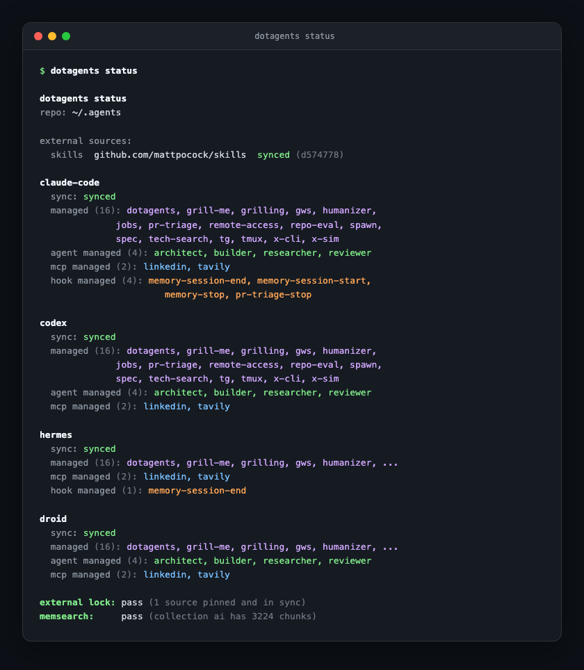

# dotagents

Dotfiles for your AI agents.

One `~/.agents` git repository holds your skills, MCP servers, hooks, and agent roles. The `dotagents` CLI syncs them into the native format of every coding agent you use and follows you across machines the way dotfiles do. External skills are commit-pinned and audited before any agent loads them.

**[Overview & comparison →](https://yourconscience.github.io/dotagents/)** · [Releases](https://github.com/yourconscience/dotagents/releases)

<p align="center"></p>

## Why

If you use more than one coding agent, you maintain the same skills, MCP servers, hooks, and roles in a different place and format for each one. Copying them by hand drifts within a week. dotagents applies the dotfiles pattern to agent config: one versioned repo, rendered into each harness's native format.

## Quick start

Install the CLI (macOS or Linux):

```bash
brew install yourconscience/tap/dotagents

# or: prebuilt binary
curl -fsSL https://raw.githubusercontent.com/yourconscience/dotagents/main/scripts/install.sh | sh

# or: from source
go install github.com/yourconscience/dotagents/cmd/dotagents@latest
```

Then run:

```bash
dotagents setup
```

`setup` does everything a first run needs, interactively:

1. Creates `~/.agents` if it does not exist and copies in the starter content (two skills, five roles, memory hooks, a minimal `dotagents.yaml`).
2. Detects which harnesses are installed and records their native paths.
3. Scans each harness for skills, roles, and MCP servers you already have and shows a review screen: one row per item, share/keep/skip per row, items identical across harnesses shared automatically. Copy-only, originals untouched. Non-interactive runs fall back to sequential prompts; `--yes` imports everything without prompting, `--dry-run` prints the candidates and exits without changes, `--json` emits the detection result for scripting and exits.
4. Before its first sync touches a harness that already has content, shows exactly what would be removed or overwritten there and asks per harness. Declining keeps that harness's files.
5. Offers to `git init` the new repository, and runs the first sync.

The review screen in step 3 looks like this — `space` cycles share/keep/skip per row, `enter` applies:

```
dotagents setup — review 3 item(s)  (2 identical, shared automatically)

  skill   grilling   claude-code✓ codex✓ droid·   [share]
  skill   my-notes   claude-code✓ codex· droid✓   [share] (differ) from claude-code
  role    reviewer   claude-code✓ codex✓ droid✓   [skip]

↑↓ move  space cycle action  ←→ pick source  a share-all  s skip-all  enter apply  q abort
```

To carry the same setup to other machines, add a private remote:

```bash
cd ~/.agents
git remote add origin <your-private-repository>
git push -u origin main
# on the next machine: clone it to ~/.agents, install dotagents, run dotagents setup
```

Verify state any time:

```bash
dotagents status   # per-harness sync state
dotagents doctor   # health checks: frontmatter, lock pins, audits, hooks
```

## What it syncs

Five surfaces, each rendered into the harness's own format — dotagents does not invent compatibility files a harness cannot consume:

1. **Skills** — `SKILL.md` directories, symlinked or copied to each harness's skill root.
2. **MCP servers** — one YAML entry, rendered into each supported native config (JSON, TOML, or YAML as the harness requires).
3. **Hooks** — lifecycle hooks registered only where the harness exposes a verified hook surface.
4. **Agent roles** — Markdown role definitions rendered to native formats (Claude Markdown, Codex TOML, Droid).
5. **Plugins** — external sources with an [agent-plugins-spec](https://agent-plugins.org) `plugin.json` get their skills and MCP servers discovered automatically. Native plugin projection (Codex `.codex-plugin/`) is planned.

| Harness | Skills | Roles | MCP | Hooks | Plugins |
|---|---|---|---|---|---|
| Claude Code | yes | yes | yes | yes | -- |
| Codex | yes | yes | yes | yes | planned |
| Factory Droid | yes | yes | yes | yes | -- |
| Hermes | yes | -- | yes | yes | -- |
| OpenCode | yes† | yes | yes | -- | -- |
| Pi* | yes | --* | --* | -- | -- |

\* Vanilla [pi](https://github.com/earendil-works/pi) is skills-only by design. If you run the OMP fork instead, dotagents detects it separately and additionally manages roles and MCP servers there — the two never conflict.

† OpenCode reads `~/.agents/skills/` natively, so dotagents delivers skills without a mirror when the config root is `~/.agents`; a custom config root mirrors into `~/.config/opencode/skills/` like other harnesses. OpenCode's only hook surface is a JS plugin API, so hooks stay unsupported.

Amp and OpenClaw can read the repo's skills through standard conventions but are not managed; a surface gets a "yes" above only after its native behavior is verified end to end.

## Working with skills

A skill is a directory under `~/.agents/skills/` containing a `SKILL.md` with name and description frontmatter ([agentskills.io](https://agentskills.io) convention). Create one and it appears in every configured harness:

```bash
dotagents skill new review-checklist --description "Pre-merge review checklist"
dotagents sync
```

Already wrote a skill inside one harness? Promote it to canonical so every agent gets it:

```bash
dotagents skill promote my-skill        # finds it in a native skill root, copies it under ~/.agents
```

### External skills: pinned, audited

Pulling skills from other people's repos is installing prompt code from strangers — dotagents treats it like a dependency, not a download. Declare a source in `dotagents.yaml`:

```yaml
external_skills:
  - url: https://github.com/mattpocock/skills
    branch: main
    skill_dirs: [skills/productivity/grilling]
    materialize: true
```

- `dotagents.lock` pins the source to an exact commit; agents only ever see the pinned tree.
- `materialize: true` copies the selected directories into `~/.agents/skills/<name>` so the content is versioned in your repo and diffable on update.
- `dotagents skill update [name ...]` is the only thing that advances a pin — updates are deliberate, never implicit.
- `dotagents doctor` scans external sources for risky patterns (exfiltration, shell abuse) and detects drift between the lock and the materialized copies.

## MCP servers

Declare once, target the harnesses you want:

```yaml
mcp_servers:
  - name: tavily
    enabled: true
    command: npx
    args: [-y, mcp-remote@0.1.38, "https://mcp.tavily.com/mcp"]
    agents: [claude-code, codex, hermes, droid]
```

`dotagents mcp list|add|import|remove` manages entries from the CLI; `import` pulls servers you already configured in a harness into the canonical config. Secrets belong in env var references — import refuses literal secrets in command arguments.

## Agent roles

A role is a Markdown file in `~/.agents/agents/` with frontmatter (`name`, `description`, `model`, `effort`, `tools`, optional per-harness overrides) and the system prompt as body. dotagents renders it into each harness's native format — e.g. TOML for Codex. Five generic starter roles ship with the tool: `architect` `builder` `researcher` `reviewer` `tester`. A same-name file in your `~/.agents/agents/` always wins over the starter.

## Hooks and memory

Hooks are lifecycle commands (session start/end, stop) registered per harness in `dotagents.yaml`. dotagents ships a memory integration built on them — pick a tier during setup:

```bash
dotagents setup --memory basic      # default
dotagents setup --memory off
dotagents setup --memory memsearch
```

| Tier | Behavior | Dependency |
|---|---|---|
| `off` | no managed memory hooks | none |
| `basic` | appends a bounded digest of each session to `$KNOWLEDGE_DIR/sessions/YYYY-MM-DD.md` and injects recent digests as context at session start | Python 3 |
| `memsearch` | full-text indexed search over the knowledge vault | `memsearch` on PATH (`uv tool install memsearch`) |

Memory data lives in your knowledge directory (default `~/Workspace/knowledge`, configurable via `KNOWLEDGE_DIR`), never in the tool repository.

## Command reference

```bash
dotagents setup    [--memory off|basic|memsearch] [--agents ...] [--yes] [--dry-run] [--json]   # first run, import review, memory tier, first sync
dotagents status   [--agents ...]                                  # per-harness sync state
dotagents sync     [--pull] [--agents ...]                         # reconcile all harnesses (--pull: git pull first)
dotagents doctor   [--e2e] [--agents ...]                          # health checks and audits
dotagents skill    new|update|promote                              # create, advance pins, canonicalize
dotagents mcp      list|add|import|remove                          # manage MCP entries
```

`dotagents help --all` lists maintenance commands and compatibility aliases.

## Configuration

`~/.agents/dotagents.yaml` is the single source of truth. The shipped template is intentionally small — `setup` fills in detected harnesses:

```yaml
version: 1
agents: [] # populated by dotagents setup

external_skills:
  - url: https://github.com/mattpocock/skills
    branch: main
    skill_dirs: [skills/productivity/grilling]
    materialize: true
```

- Config resolution order: `--config <path>` → `$DOTAGENTS_HOME/dotagents.yaml` → `~/.agents/dotagents.yaml`. dotagents never walks the current project directory looking for config.
- `dotagents.local.yaml` next to the main config overlays machine-local entries (kept out of git) on top of the shared ones.
- Managed entries are marked as such in native configs; anything dotagents did not create is left untouched.

<!-- BEGIN GENERATED SKILLS -->
2 skills ship with this repo:

`dotagents` `grilling`
<!-- END GENERATED SKILLS -->

## Troubleshooting

- **`dotagents doctor`** is the first stop: it validates skill frontmatter, role definitions, lock pins, materialized copies, hook registration, and audits external sources.
- **Upgrading from an old config** that targets agent `pi` with MCP: vanilla Pi has no MCP surface, so the target is ignored with a warning — rename `pi` to `omp` in `dotagents.yaml` if you meant the OMP fork.
- **A sync proposed removals you didn't expect:** setup-driven syncs always preview removals per harness and default to keeping your files; answer `n` and inspect with `dotagents status`.

## How it differs

| Tool | Scope | What it does |
|---|---|---|
| [rulesync](https://github.com/dyoshikawa/rulesync), [ruler](https://github.com/intellectronica/ruler) | per-project | Generate agent config inside a repo |
| [openskills](https://github.com/numman-ali/openskills) | user-level | Install skills |
| [dot-agents](https://github.com/dot-agents/dot-agents) | user-level | Symlink rules and MCP config once |
| [dotagent](https://github.com/johnlindquist/dotagent) | one-shot | Convert between agent config formats |
| `AGENTS.md` | per-project | Project-level agent instructions |
| **dotagents** | user-level | Sync skills, MCP, hooks, and roles across harnesses continuously |

## License

[MIT](./LICENSE)
